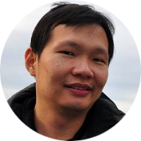

## Overview

Every day over 450 million photos and videos are being uploaded to Facebook and Instagram. The exponential growth of visual media has made quality assessment become increasingly important for various applications, including image and video acquisition, synthesis, restoration, enhancement, search and retrieval, storage, and recognition. 

Broadly, visual quality assessment techniques can be divided into image and video technical quality assessment (IQA and VQA, or broadly TQA) and aesthetics quality assessment (AQA). TQA focuses on the effect of image-level technical aspects of perceived quality, such as sharpness, noise, color reproduction, contrast, dynamic range, and others. On the other hand, AQA deals with more abstract aesthetics-related quality factors that capture the subjective aesthetics experience. Aesthetics judgments are associated with the adherence to established photographic rules encompassing lighting (emphasis, contrast), composition, colors, and more. Even though these topics have mostly been studied independently, they represent tightly related aspects of the same underlying subjective experience of media items, value judgments. 

This workshop aims to bring together individuals in the two fields of TQA and AQA for sharing of ideas and discussions on current trends, developments, issues, and future directions, with the vision to accelerate the progress of research in both fields. Our hope is that bridging TQA and AQA, will result in a better understanding of quantitative measures of quality of experience in the broader context of multimedia applications.

### Scope 

The scope of this workshop spans:
* **Analysis and prediction of aesthetic and technical visual quality**, encompassing absolute and comparative judgments about visual media:
  * Traditional and deep-learning-based approaches
  * Aesthetics and QoE related concepts such as interestingness, popularity, viralness
* **Datasets for TQA and AQA**, including:
  * New approaches to data collection procedures and sources
  * New data augmentation methods	
* **Applications of TQA and AQA** in computer vision or image processing tasks:
  * Visual filtering and retrieval (recommendation, image gallery/video)
  * Visual editing (recomposition, retargeting, cropping)
  * Assessment guided visual enhancement
  * Real-world systems and applications
  * Applications to media such as light fields, 360 or stereo, point clouds.
 
 

## Important dates

|||
| :--- |---: |
| Submission Deadline for Workshop Papers       |  ~~July 30th 2020~~ August 10th 2020  |
| Notification of Acceptance of Workshop Papers |  August 26th 2020   |
| Workshop Camera-Ready Papers Due by           |  September 2nd 2020 |
| Workshop Date                                 |  October 12th 2020 |

All deadlines are at midnight (23:59) Anywhere on Earth.

> These are the latest updates since September 21st 2020. 

 

## Paper submission

Authors are invited to submit a full paper (two-column format, 6-8 pages, not including references) electronically according to the guidelines available on the conference website at [2020.acmmm.org](https://2020.acmmm.org/). We use the same formatting template as ACM Multimedia 2019. All contributions must be submitted through CMT using the following link: [cmt3.research.microsoft.com/MMW2020](https://cmt3.research.microsoft.com/MMW2020). 
Accepted papers will be published in the ACM Digital Library alongside the ACM Multimedia main conference papers.

Please find the <a href="assets/docs/ATQAM-CFP.pdf"> call for papers here</a>.
 

## Invited speakers

[Al Bovik](http://www.ece.utexas.edu/people/faculty/alan-bovik) is the Cockrell Family Regents Endowed Chair Professor at The University of Texas at Austin. His research interests land squarely at the nexus of visual neuroscience and digital pictures. His many international honors include the 2019 Progress Medal of the Royal Photographic Society, the 2019 IEEE Fourier Award, the 2017 OSA Edwin H. Land Medal, a 2015 Primetime Emmy Award from the Academy of Television Arts and Sciences, and the Norbert Wiener and ‘Sustained Impact’ Awards of the IEEE Signal Processing Society.

_Talk title: "Speeding it Up: Perception of High-Frame Rate Videos"_ ([Presentation Abstract](https://atqam-workshop.net/assets/docs/ACM_MM_Workshop_KeynoteAbstract_AlanBovik.pdf))

[James Z. Wang](http://infolab.stanford.edu/~wangz/home/) is a Professor of Information Sciences and Technology at The Pennsylvania State University. He received the bachelor’s degree in mathematics and computer science summa cum laude from University of Minnesota, and the MS degree in mathematics, the MS degree in computer science, and the PhD degree in medical information sciences, all from Stanford University.
His research primarily focuses on the modeling of objects, concepts, aesthetics, and emotions in big visual data, with applications in biomedicine, visual art, meteorology, psychology, and social media. He was a recipient of the National Science Foundation Career Award (2004) and Amazon Research Awards (2018 and 2019).
He was a Visiting Professor with the Robotics Institute, Carnegie Mellon University, from 2007 to 2008. He was a Lead Special Section Guest Editor for IEEE Transactions on Pattern Analysis and Machine Intelligence (2008). In 2011 and 2012, he served as a Program Manager at the Office of the Director of the National Science Foundation where he managed international collaboration programs covering all sciences and engineering disciplines.

_Talk title: "Modeling Aesthetics and Emotions in Visual Content: From Vincent van Gogh to Robotics and Vision"_ ([Presentation Abstract](https://atqam-workshop.net/assets/docs/ACM_MM_Workshop_KeynoteAbstract_JamesWang.pdf))

 

## Program

ATQAM will take place from 8:00 AM to 11:00 AM (Eastern Time) on the 12th of October 2020.
The ATQAM/MAST 2020 Workshop Proceedings are now available in the [ACM Digital Library](https://dl.acm.org/doi/proceedings/10.1145/3423268).

Time | Session
-- | -- 
8:00 - 8:05 &nbsp; &nbsp; &nbsp; &nbsp; &nbsp; &nbsp; &nbsp; &nbsp; &nbsp; &nbsp; &nbsp; &nbsp; &nbsp; &nbsp; &nbsp; | **Front Matter**
8:05 - 9:10 AM | **Session 1: Keynote & Invited Talk**
8:05 - 8:50 AM | Speeding it Up: Perception of High-Frame Rate Videos ([Abstract](https://atqam-workshop.net/assets/docs/ACM_MM_Workshop_KeynoteAbstract_AlanBovik.pdf), [Presentation](http://vqa.mmsp-kn.de/misc/atqam/keynote1_bovik.mp4))   _Alan C. Bovik_
8:50 - 9:10 AM | Going Big or Going Precise: Considerations in building the next-gen VQA Database ([Presentation](http://vqa.mmsp-kn.de/misc/atqam/invited_talk1_gotz-hahn.mp4))   _Franz Götz-Hahn_
9:10 - 9:30 AM | **Session 2** 
9:10 - 9:30 AM | EVA: An Explainable Visual Aesthetics Dataset ([Presentation](https://vqa.mmsp-kn.de/misc/atqam/ATQAM-MAST20-atqmma84.mp4))   _Chen Kang, Giuseppe Valenzise, Frederic Dufaux_
| _Coffee Break_ 
9:40 - 11:00 AM | **Session 3: Keynote & Invited Talks**
9:40 - 10:20 AM | Modeling Aesthetics and Emotions in Visual Content - From Vincent van Gogh to Robotics and Vision ([Abstract](https://atqam-workshop.net/assets/docs/ACM_MM_Workshop_KeynoteAbstract_JamesWang.pdf), [Presentation](http://vqa.mmsp-kn.de/misc/atqam/keynote2_james-wang.mp4))   _James Z. Wang_
10:20 - 10:40 AM | Rating  Distribution & Personality Prediction for Image Aesthetics Assessment ([Presentation](http://vqa.mmsp-kn.de/misc/atqam/invited_talk2_wslin.mp4))   _Weisi Lin_
10:40 - 11:00 AM | From Technical to Aesthetics Quality Assessment and Beyond: Challenges and Potential ([Presentation](http://vqa.mmsp-kn.de/misc/atqam/invited_talk3_vlad.mp4))   _Vlad Hosu, Dietmar Saupe, Bastian Goldlücke, Weisi Lin, Wen-Huang Cheng, John See, Lai-Kuan Wong_
| _Lunch Break_ 

 

## Organizers

<table id="profile">
    <tr>
     <td></td>
     <td></td>
     <td></td>
     <td></td>
     <td></td>
     <td></td>
     <td></td>
    </tr>
    <tr align="top">
     <td> <a href="http://aimmlab.nctu.edu.tw/whcheng/index.html">
      Wen-Huang  Cheng</a>  NCTU,  Taiwan </td>
     <td> <a href="https://www.cvia.uni-konstanz.de/personen/prof-dr-bastian-goldluecke/">
      Bastian  Goldlücke</a>  Uni-KN, Germany </td>
     <td> <a href="https://www.mmsp.uni-konstanz.de/people/overview/research-staff/vlad-hosu/">
      Vlad  Hosu</a>  Uni-KN, Germany </td>
     <td> <a href="https://www.ntu.edu.sg/home/wslin/">
      Weisi  Lin</a>  NTU, Singapore </td>
     <td> <a href="https://www.mmsp.uni-konstanz.de/people/overview/prof-dr-dietmar-saupe/">
      Dietmar  Saupe</a>  Uni-KN, Germany </td>
     <td> <a href="https://mmuexpert.mmu.edu.my/johnsee">
      John  See</a>  MMU, Malaysia </td>
     <td> <a href="https://mmuexpert.mmu.edu.my/lkwong">
      Lai-Kuan  Wong</a>  MMU, Malaysia </td>
    </tr>
    <!--<tr align="top">
     <td/> <td/> 
     <td></td> 
     <td/> <td/> 
     <td></td>
     <td></td>
    </tr>-->
</table>

**Primary contacts**: [Vlad Hosu](mailto:vlad.hosu@uni-konstanz.de), [John See](mailto:johnsee@mmu.edu.my) and [Lai Kuan Wong](mailto:lkwong@mmu.edu.my).

## Technical Program Committee

* Seyed Ali	Amirshahi	- NTNU, Norway
* Raouf	Hamzaoui	- De Montfort University, UK
* Matthias Hirth -	TU Ilmenau, Germany
* Shujun	Li	- University of Kent, UK
* Hanhe	Lin	- University of Konstanz, Germany
* Yuen Peng	Loh	- Multimedia University, Malaysia

## Sponsor

