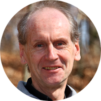

## Overview

Every day over 450 million photos and videos are being uploaded to Facebook and Instagram. The exponential growth of visual media has made quality assessment become increasingly important for various applications, including image and video acquisition, synthesis, restoration, enhancement, search and retrieval, storage, and recognition. Broadly, visual quality assessment techniques can be divided into image and video technical quality assessment (IQA and VQA, or broadly TQA) and aesthetics quality assessment (AQA). TQA focuses on the effect of image-level technical aspects of perceived quality, such as sharpness, noise, color reproduction, contrast, dynamic range, and others. On the other hand, AQA deals with more abstract aesthetics-related quality factors that capture the subjective aesthetics experience. Aesthetics judgments are associated with the adherence to established photographic rules encompassing lighting (emphasis, contrast), composition, colors, and more. Even though these topics have mostly been studied independently, they represent tightly related aspects of the same underlying subjective experience of media items, value judgments. This workshop aims to bring together individuals in the two fields of TQA and AQA for sharing of ideas and discussions on current trends, developments, issues, and future directions, with the vision to accelerate the progress of research in both fields. Our hope is that bridging TQA and AQA, will result in a better understanding of quantitative measures of quality of experience in the broader context of multimedia applications.

### Scope 

The scope of this workshop spans:
* Analysis and prediction of aesthetic and technical visual quality, encompassing absolute and comparative judgments about visual media:
  * Traditional and deep-learning-based approaches
  * Aesthetics and QoE related concepts such as interestingness, popularity, viralness
* Datasets for TQA and AQA, including:
  * New approaches to data collection procedures and sources
  * New data augmentation methods	
* Applications of T/AQA in computer vision or image processing tasks:
  * Visual filtering and retrieval (recommendation, image gallery/video)
  * Visual editing (recomposition, retargeting, cropping)
  * Assessment guided visual enhancement
  * Real-world systems and applications
  * Applications to media such as light fields, 360 or stereo, point clouds.
 
Authors are invited to submit a full paper (two-column format, 6-8 pages) electronically according to the guidelines available on the conference website at [2020.acmmm.org](https://2020.acmmm.org/).

 

## Important dates

|  |  |
| :--- |---: |
| Submission Deadline for Workshop Papers       |  29th June 2020   |
| Notification of Acceptance of Workshop Papers | 2nd August 2020   |
| Workshop Camera-Ready Papers Due by           |  16th August 2020 |

All deadlines are at midnight (23:59) Anywhere on Earth.

> As of 28th March 2020, there are no changes for the workshop paper submission deadlines. 
Unless we hear anything different from the Conference organizers, the dates are as advertised before.

 

## Paper submission

We use the same formatting template as ACM Multimedia 2019 and we seek two kind of submissions:

Original contributions: full 6-8 page paper submissions (not including references).
Extended abstracts: with preliminary results, 2-page submissions (not including references).
All contributions must be submitted through CMT using the following link: [cmt3.research.microsoft.com/ATQAM](https://cmt3.research.microsoft.com/ATQAM)

 

## Invited speakers

[Alan Conrad Bovik](http://www.ece.utexas.edu/people/faculty/alan-bovik) is an American engineer and vision scientist. He is a Professor at The University of Texas at Austin (UT-Austin), where he holds the Cockrell Family Regents Endowed Chair and is Director of the Laboratory for Image and Video Engineering. He is a faculty member in the UT-Austin Department of Electrical and Computer Engineering, the Institute for Neuroscience, and the Wireless Networking and Communications Group. Bovik won a Primetime Emmy Award in 2015 for his development of video quality measurement tools that are now standards in television production. Two of Bovik's research publications in the area of visual image quality have been recognized as 2017 Google Scholar Classic Papers, which are selected for being highly-cited papers that have stood the test of time, and are among the ten most-cited articles in their area of research published ten years earlier.

_Talk title and abstract: TBA._

<!-- 

[James Z. Wang](http://infolab.stanford.edu/~wangz/home/) is a professor at Pennsylvania State University. Wang's research seeks to advance knowledge through modeling objects, concepts, aesthetics, and emotions in big visual data. He is well-known for his pioneering research in the field of aesthetics quality assessment. His research team have developed the ACQUINE aesthetic quality inference engine, SIMPLIcity semantics-sensitive image retrieval system, the ALIPR real-time computerized image tagging system, which are all widely cited. His research has been reported widely by significant media, including Discovery, Scientific American, MIT Tech Review, Public Radio, NPR, and CBS. Wang also received an NSF Career award and the endowed PNC Technologies Career Development Professorship.

_Talk title and abstract: TBA._
-->
 

## Program

To be announced.

 

## Organizers

<table id="profile">
    <tr>
     <td></td>
     <td></td>
     <td></td>
     <td></td>
     <td></td>
     <td></td>
     <td></td>
    </tr>
    <tr align="top">
     <td> <a href="http://aimmlab.nctu.edu.tw/whcheng/index.html">Wen-Huang  Cheng</a>  NCTU,  Taiwan </td>
     <td> <a href="https://www.cvia.uni-konstanz.de/personen/prof-dr-bastian-goldluecke/">Bastian  Goldlücke</a>  Uni-KN, Germany </td>
     <td> <a href="https://www.mmsp.uni-konstanz.de/people/overview/research-staff/vlad-hosu/">Vlad  Hosu</a>  Uni-KN, Germany </td>
     <td> <a href="https://www.ntu.edu.sg/home/wslin/">Weisi  Lin</a>  NTU, Singapore </td>
     <td> <a href="https://www.mmsp.uni-konstanz.de/people/overview/prof-dr-dietmar-saupe/">Dietmar  Saupe</a>  Uni-KN, Germany </td>
     <td> <a href="https://mmuexpert.mmu.edu.my/johnsee">John  See</a>  MMU, Malaysia </td>
     <td> <a href="https://mmuexpert.mmu.edu.my/lkwong">Lai-Kuan  Wong</a>  MMU, Malaysia </td>
    </tr>
</table>

*Primary contacts*: [Vlad Hosu](mailto:vlad.hosu@uni-konstanz.de), [John See](mailto:johnsee@mmu.edu.my), [Lai Kuan Wong](mailto:lkwong@mmu.edu.my).

